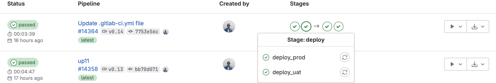
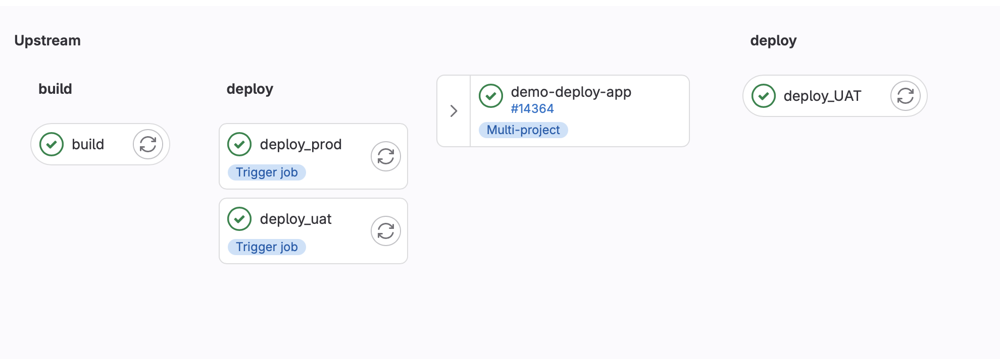

# Terraform AWS ECS with PostgreSQL and Redis

This Terraform module deploys an application on two [Amazon EC2](https://aws.amazon.com/ec2/) instances, 
a PostgreSQL and Redis (standalone) on a separate EC2 instance on AWS.

## Prerequisites

- Terraform and Packer installed on your local machine.
- An AWS account and your AWS credentials set as environment variables AWS_ACCESS_KEY_ID and AWS_SECRET_ACCESS_KEY.
- Configure your AWS credentials using the [AWS CLI](https://aws.amazon.com/cli/).
- Install all required tools like terraform, packer and etc.

These modules uses default networking AWS setup (it will not create new vpc etc.)

## Packer
This project uses Packer to define an Amazon Machine Image (AMI) for a 'kutt-server-aws' instance.

### Requirements

- Packer >= 1.7.3
- Amazon Packer Plugin >= 1.0.0, which can be fetched from "github.com/hashicorp/amazon"
- AWS credentials set up for your environment

### Configuration
The 'kutt-server-aws' instance is based on AMI 'ami-04e601abe3e1a910f' and uses a 't2.micro' instance type in the 'eu-central-1' region. All connection to the instance is made via the 'ubuntu' user.
A unique timestamped name is given to each generated AMI to distinguish it from the others.


## Terraform - Getting Started

1. Clone this repository:
   ```
   git clone https://github.com/username/repository.git
   ```
2. Navigate to the repository:
   ```
   cd path/to/repository
   ```
3. Initialize Packer
   ```shell
   cd packer
   packer build . 
   ```
4. Initialize Terraform:
    ```
    cd envs/prod/
    terraform init
    ```
5. Run a Terraform plan:
    ```
    terraform plan
    ```
6. Apply the Terraform stack:
    ```
    terraform apply 
    different version of the build can be run with using variable passing as param
   ex: terraform apply -var="app_version=v2.7.4
    ```

## Automated deployment

The automated deployment part can be done using GitLab and multi project builds, example configuration:
I put my terraform project in gitlab project named `terraform` with following `.gitlab-ci.yml`
```shell

stages:
  - deploy

deploy_UAT:
  image: ubuntu
  stage: deploy
  script:
    - cd envs/uat
    - apt update && apt install -y wget  unzip  vim openssh-client
    - wget https://releases.hashicorp.com/terraform/1.6.1/terraform_1.6.1_linux_amd64.zip
    - unzip terraform_1.6.1_linux_amd64.zip
    - mv terraform /usr/local/bin/
    - terraform init
    - terraform plan -var="app_version=${VERSION_DEPLOY}"
    - terraform apply -var="app_version=${VERSION_DEPLOY}"
  rules:
    - if: $RUN_ENV == "UAT"
      when: always
    - when: never

deploy_PROD:
  image: ubuntu
  stage: deploy
  script:
    - cd envs/prod
    - apt update && apt install -y wget  unzip  vim openssh-client
    - wget https://releases.hashicorp.com/terraform/1.6.1/terraform_1.6.1_linux_amd64.zip
    - unzip terraform_1.6.1_linux_amd64.zip
    - mv terraform /usr/local/bin/
    - terraform init
    - terraform plan -var="app_version=${VERSION_DEPLOY}"
    - terraform apply -var="app_version=${VERSION_DEPLOY}"
  rules:
    - if: $RUN_ENV == "PROD"
      when: always
    - when: never
```
And in project which is using it, for example kutt app, my config file looks like:
```shell
variables:
  IMG: "registry.yuks.me/demo_app:$CI_COMMIT_TAG"

stages:
  - build
  - deploy

build:
  stage: build
  image:
    name: gcr.io/kaniko-project/executor:debug
    entrypoint: [ "" ]
  script:
    - mkdir -p /kaniko/.docker
    - echo "{\"auths\":{\"registry.yuks.me\":{\"username\":\"XXXXXXX\",\"password\":\"XXXXXXX\"}}}" > /kaniko/.docker/config.json
    - cat /kaniko/.docker/config.json
    - /kaniko/executor --context $CI_PROJECT_DIR --dockerfile $CI_PROJECT_DIR/Dockerfile --destination "$IMG" --single-snapshot
  only:
    - tags

deploy_uat:
  stage: deploy
  when: manual
  only:
    - tags
  variables:
    VERSION_DEPLOY: $CI_COMMIT_TAG
    RUN_ENV: "UAT"
  trigger:
    project: misc/terraform
    strategy: depend

deploy_prod:
  stage: deploy
  when: manual
  only:
    - tags
  variables:
    VERSION_DEPLOY: $CI_COMMIT_TAG
    RUN_ENV: "PROD"
  trigger:
    project: misc/terraform
    strategy: depend
```

In this setup, Docker is utilized alongside a private Docker registry to manage various build versions. 
The strategy for release management is streamlined, leveraging git tags for version control. 
Deployment actions are manually initiated. Upon initiation, the `trigger` keyword is invoked, consequently launching the corresponding task in the Terraform project.




### Notes:
The Terraform state is maintained using pre-configured S3 buckets and DynamoDB tables.

A DNS record, `demo01.yuks.me`, was created and directed to AWS Route53 for testing purposes. 
I've set up multiple environments such as 'prod' and 'uat', each using AWS Load balancer with different subdomains. 
They can be accessed through http://demo01.yuks.me and http://uat.demo01.yuks.me respectively. 
While I've not implemented SSL at this time, it can be accomplished using AWS Certificate Manager in future if needed.

### Kaniko build tool
In this project, I'm using `gcr.io/kaniko-project/executor:debug` which is a specific variation of the Kaniko executor. 
Kaniko is leveraged to build Docker images from a Dockerfile, particularly useful in environments without a Docker daemon.
The `debug` version incorporates a busybox shell, providing us with the ability to debug our builds and observe the underlying processes. 
Apart from debugging, it empowers us to perform introspection and understand the processes in an in-depth manner. 